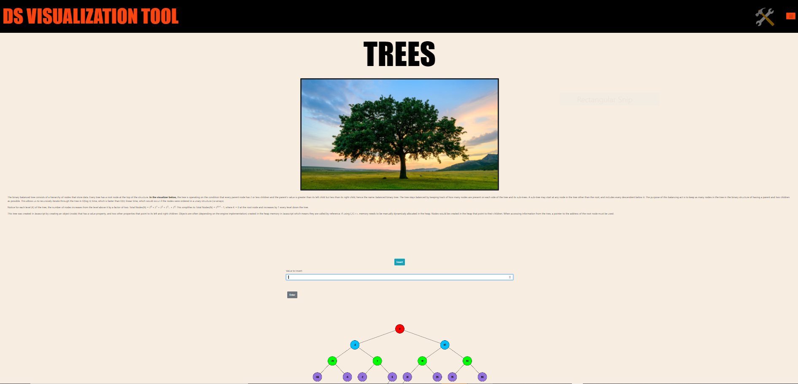

# DataStruct

This client side app generates interactive visual representations of data structures using HTML Canvas and React.js. It is currently in progress. Arrays and balanced binary trees have been implemented thus far. This app may aid visual learners in understanding the run-time and space-time complexity (Big O) of various data structures. Stacks, queues, linked lists, hash tables, and graphs are to come. 

[Click here](https://cnmiller127.github.io/data-struct/#/) to see the current state of the project. 

